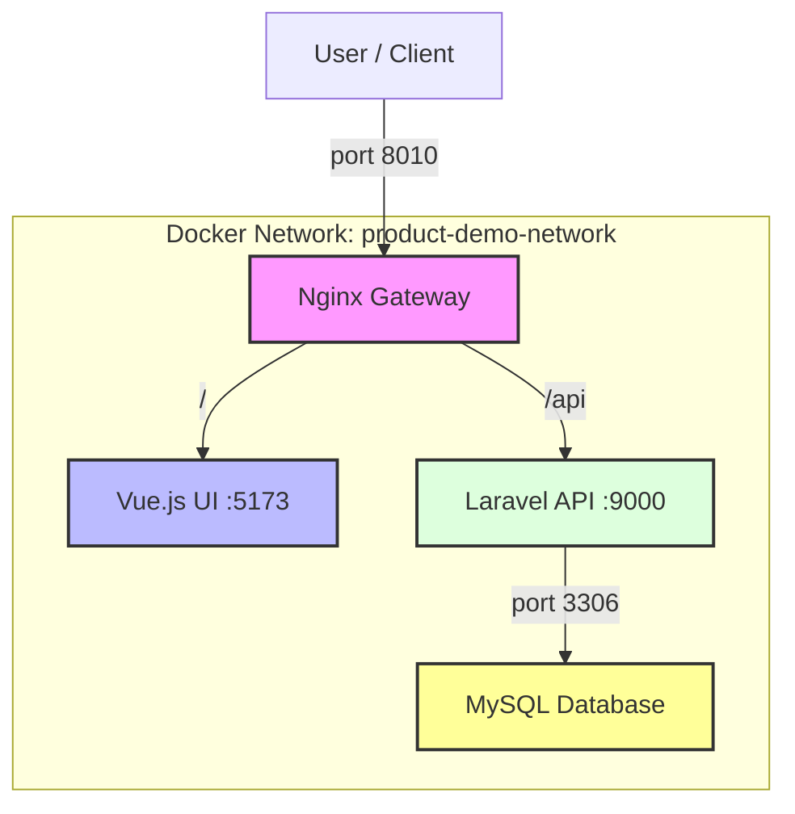

# Docker Microservices Tutorial: Products Demo

โปรเจกต์นี้เป็น Tutorial สำหรับการเรียนรู้สถาปัตยกรรมแบบ Microservices โดยใช้ Docker ครับ
ระบบประกอบด้วย 4 เซอร์วิสแยกกัน ทำงานบนเครือข่าย Docker เดียวกัน

## โครงสร้างโปรเจกต์ (System Overview)




- **/products-db**: ฐานข้อมูล MySQL
- **/products-api**: Backend API พัฒนาด้วย Laravel
- **/products-ui**: Frontend Web App พัฒนาด้วย Vue.js
- **/products-gateway**: Reverse Proxy ด้วย Nginx

## ขั้นตอนการติดตั้งและใช้งานทั้งหมด

ทำตามขั้นตอนต่อไปนี้เพื่อรันโปรเจกต์ทั้งหมด

### 1. การตั้งค่า Host File

เพื่อให้สามารถเข้าถึงเซอร์วิสผ่านโดเมน `www.products.local` และ `api.products.local` ได้ คุณจำเป็นต้องแก้ไขไฟล์ hosts ของเครื่องคอมพิวเตอร์ของคุณก่อน

**สำหรับ macOS / Linux:**

เปิด Terminal แล้วใช้คำสั่ง:

```bash
sudo nano /etc/hosts
```

**สำหรับ Windows:**

เปิด Notepad **ด้วยสิทธิ์ Administrator** แล้วเปิดไฟล์:

```
C:\Windows\System32\drivers\etc\hosts
```

จากนั้น เพิ่ม 2 บรรทัดนี้เข้าไปที่ท้ายไฟล์ แล้ว Save:

```
127.0.0.1   www.products.local
127.0.0.1   api.products.local
```

### 2. สร้าง Docker Network

เราจะสร้างเครือข่ายกลางชื่อ `product-demo-network` เพื่อให้ทุก Container สามารถสื่อสารกันได้ผ่านชื่อเซอร์วิสของมัน

เปิด Terminal แล้วรันคำสั่ง:

```bash
docker network create product-demo-network
```

### 3. รันแต่ละโปรเจกต์
 
 เข้าไปในโฟลเดอร์ของแต่ละโปรเจกต์แล้วรันคำสั่ง `docker-compose up -d --build`
 
 **ลำดับการรันที่แนะนำ:**
 
 1.  `products-db`
 2.  `products-api` (ต้องรอให้ `products-db` พร้อมใช้งานก่อน)
     *   *หมายเหตุ:* หากรันครั้งแรก ต้องรันคำสั่งเพื่อติดตั้ง Sanctum และ Migrate Database:
         ```bash
         docker exec products-api-container composer install
         docker exec products-api-container php artisan migrate
         docker exec products-api-container php artisan vendor:publish --provider="Laravel\Sanctum\SanctumServiceProvider"
         ```
 3.  `products-ui`
     *   **Development Mode** (Hot Reload):
         ```bash
         docker-compose -f docker-compose.dev.yml up -d --build
         ```
     *   **Production Mode** (Static Build):
         ```bash
         docker-compose -f docker-compose.prod.yml up -d --build
         ```
 4.  `products-gateway`
 
 ### 4. เข้าใช้งานระบบ
 
 -   **หน้าเว็บ UI**: เปิดเบราว์เซอร์แล้วไปที่ `http://www.products.local:8010`
     -   *New Feature:* UI แบบ Single Page Dashboard ไม่ต้อง Scroll
     -   *New Feature:* รองรับ Dark Mode (แสดงผลถูกต้องทุก Theme)
 -   **API**: ทดสอบได้ที่ `http://api.products.local:8010/api/products`
     -   มีไฟล์ **Postman Collection** (`Product Demo.postman_collection.json`) ให้ในโปรเจกต์ สำหรับทดสอบ CRUD ครบทุก endpoint

## คำอธิบาย: ทำไมต้องใช้ Shared Network?

การที่เราสร้าง `product-demo-network` ขึ้นมาเป็นเครือข่ายกลางมีประโยชน์หลายอย่างในสถาปัตยกรรมแบบ Microservices:

1.  **Service Discovery**: Container ที่อยู่ใน network เดียวกันสามารถเรียกหากันได้โดยใช้ "ชื่อ Container" หรือ "ชื่อ Service" ที่กำหนดใน `docker-compose.yml` แทนที่จะใช้ IP Address ที่อาจเปลี่ยนแปลงได้ตลอดเวลา เช่น `products-api` สามารถเรียก `products-db-container` ได้โดยตรง
2.  **ความปลอดภัย (Isolation)**: เราสามารถเลือก "เปิดเผย" (expose) แค่บาง Port ที่จำเป็นสู่ภายนอก (Host Machine) ได้ เช่น เราเปิดแค่ Port `8010` ของ Gateway ส่วน Port ของ API (`9000`) หรือฐานข้อมูล (`3306`) จะถูกเข้าถึงได้เฉพาะจากภายในเครือข่าย Docker เท่านั้น ทำให้ระบบมีความปลอดภัยสูงขึ้น
3.  **จำลองสภาพแวดล้อมจริง**: ในระบบ Production จริง เซอร์วิสต่างๆ มักจะอยู่ในเครือข่ายส่วนตัว (Private Network) และสื่อสารกันภายใน การใช้ Docker Network ช่วยให้เราจำลองสภาพแวดล้อมที่ใกล้เคียงกับของจริงได้มากที่สุด
