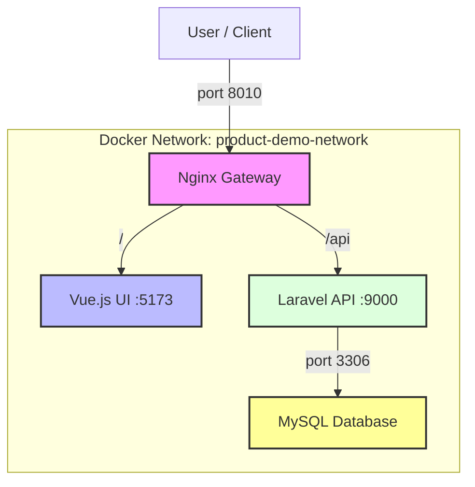

# Info-Graphic: Docker Presentation สำหรับโปรเจกต์ Products Demo

---

## **สไลด์ 1: Title Slide**

# **Docker คืออะไร?**
### **และเราจะใช้มันกับโปรเจกต์ Microservices ของเราได้อย่างไร**
#### A Guide for the "Products Demo" Project

---

## **สไลด์ 2: Docker คืออะไร? - แนวคิดหลัก**


*ภาพ: กล่องคอนเทนเนอร์สินค้าที่ข้างในมีโค้ดแอปพลิเคชันและ dependencies ต่างๆ*

**Docker คือ "กล่องมหัศจรรย์" สำหรับแอปพลิเคชันของคุณ**

**แนวคิด:** Docker คือเครื่องมือที่ใช้ "แพ็ก" แอปพลิเคชันของคุณพร้อมกับทุกสิ่งที่มันต้องการ (เช่น โค้ด, libraries, runtime, การตั้งค่า) ลงในกล่องที่เรียกว่า **Container**

**ทำไมต้องใช้?**
- **"บนเครื่องฉันรันได้นะ!" จะไม่เกิดขึ้นอีก:** ไม่ว่าจะเป็นเครื่องเพื่อน, Server, หรือ Cloud ถ้ามี Docker ก็รันได้เหมือนกันเป๊ะ
- **แยกส่วนอย่างชัดเจน (Isolation):** โปรแกรมที่รันในแต่ละ Container จะไม่ปะปนกัน ทำให้จัดการง่ายและปลอดภัย
- **พกพาสะดวก (Portability):** ยกไปรันที่ไหนก็ได้ที่มี Docker ติดตั้งอยู่

> **ในโปรเจกต์ของคุณ:** เราแพ็ก `Vue.js UI`, `Laravel API`, และ `MySQL DB` ลงใน "กล่อง" ของใครของมัน เพื่อให้ทำงานแยกจากกันได้อย่างสมบูรณ์

---

## **สไลด์ 3: คำศัพท์พื้นฐานที่ต้องรู้**

| คำศัพท์ | ไอคอน | คำอธิบาย (เปรียบเทียบกับการทำอาหาร) |
| :--- | :--- | :--- |
| **Image** | 📄 | **"พิมพ์เขียว" หรือ "สูตรอาหาร"** <br> เป็นไฟล์ Template ที่อ่านได้อย่างเดียว (Read-only) ภายในจะบอกว่าแอปพลิเคชันของเราต้องมีอะไรบ้าง เช่น "ต้องมี PHP 8.4", "ต้องมี Laravel", "ให้ Copy โค้ดของเราเข้าไป" |
| **Container** | 📦 | **"อาหารที่ปรุงเสร็จแล้ว"** <br> คือ "อินสแตนซ์" ที่ทำงานได้จริงของ Image เราสามารถสร้าง Container (อาหาร) กี่อันก็ได้จาก Image (สูตรอาหาร) เดียวกัน |
| **Service** | ⚙️ | **"คำสั่งในการปรุง"** <br> เป็นการกำหนดค่าในไฟล์ `docker-compose.yml` ว่าเราจะรัน Container นั้นๆ อย่างไร เช่น "ให้ใช้ Image นี้", "ให้เปิด Port นี้", "ให้เชื่อมต่อกับ Network นี้" |

---

## **สไลด์ 4: ไฟล์เวทมนตร์ 2 อย่างในโปรเจกต์**

### **1. `Dockerfile` - สูตรสร้าง Image**
ไฟล์นี้คือคู่มือสร้าง **Image** ทีละขั้นตอนสำหรับ Service นั้นๆ

**ตัวอย่างจาก `products-api/Dockerfile`:**
```dockerfile
# 1. เริ่มจากพิมพ์เขียวของ PHP
FROM php:8.4-fpm 

# 2. ติดตั้งเครื่องมือที่จำเป็น
RUN apt-get install -y git zip ...

# 3. Copy โค้ด Laravel ของเราเข้าไป
COPY . .

# 4. ติดตั้ง Dependencies ของ Laravel
RUN composer install

# 5. คำสั่งที่จะรันเมื่อ Container เริ่มทำงาน
CMD ["php-fpm"] 
```

> **หน้าที่ของมันคือ:** สร้าง "พิมพ์เขียว" (Image) สำหรับ `products-api` ของเรา

### **2. `docker-compose.yml` - ผู้ควบคุมวงออร์เคสตรา**
ไฟล์นี้ใช้กำหนดและสั่งรัน **Services** ทั้งหมดในโปรเจกต์ของเราพร้อมๆ กัน

**ตัวอย่างจาก `products-db/docker-compose.yml`:**
```yaml
# กำหนด Services ที่จะรัน
services:
  mysql:
    # 1. ใช้ "พิมพ์เขียว" (Image) สำเร็จรูปของ MySQL
    image: mysql:8.0 
    container_name: products-db-container
    
    # 2. ตั้งค่าต่างๆ
    environment:
      MYSQL_ROOT_PASSWORD: 1234
      
    # 3. เชื่อมต่อ Port 3310 จากเครื่องเราไปยัง Port 3306 ใน Container
    ports:
      - "3310:3306" 
      
    # 4. นำ Service นี้ไปเชื่อมกับ Network กลาง
    networks:
      - product-demo-network 
```

> **หน้าที่ของมันคือ:** สั่งให้ "อาหาร" (Containers) แต่ละจานถูกปรุง (รัน) ตาม "คำสั่ง" (Service) และจัดวางบนโต๊ะ (Network) เดียวกัน

---

## **สไลด์ 5: Service คุยกันได้อย่างไร? และภาพรวมของระบบ**

### **ทำไมต้องมี `product-demo-network`?**

เมื่อเรานำทุก Service เข้ามาอยู่ใน Network กลางที่ชื่อ `product-demo-network`...

1.  **Service Discovery:** Container สามารถเรียกหากันผ่าน **"ชื่อ Service"** ได้เลย!
    -   เช่น Nginx Gateway สามารถส่งต่อ request ไปที่ `http://products-api-container:9000` ได้โดยตรง ไม่ต้องใช้ IP Address ที่อาจเปลี่ยนไปมา

2.  **ความปลอดภัย (Isolation):** เราเปิดเผยแค่ **Port 8010** ของ Gateway ออกสู่ภายนอก
    -   ส่วน Port ของ API (9000) และ Database (3306) จะถูกเข้าถึงได้เฉพาะจาก **ภายใน Network** นี้เท่านั้น ทำให้คนข้างนอกเจาะเข้ามาที่ฐานข้อมูลโดยตรงไม่ได้

### **ภาพรวมสถาปัตยกรรมของคุณ**



> **สรุป:** Gateway เป็นเหมือนยามหน้าบ้าน คอยรับแขก (User) และพาไปส่งยังห้องที่ถูกต้อง (UI หรือ API) โดยที่ห้องต่างๆ สื่อสารกันผ่านโถงทางเดินส่วนตัว (Docker Network)

---

## **สไลด์ 6: ขั้นตอนการ Setup โปรเจกต์ (ที่คุณทำอยู่)**

1.  **แก้ไข `/etc/hosts`**
    -   **ทำไม?** เพื่อบอกให้เครื่องเรารู้จัก `www.products.local` และ `api.products.local` ว่าชี้มาที่เครื่องเราเอง (127.0.0.1)

2.  **`docker network create product-demo-network`**
    -   **ทำไม?** เพื่อสร้าง "โถงทางเดินส่วนตัว" ให้ Container ทุกตัวมาเชื่อมต่อกัน

3.  **`docker-compose up -d --build`** (ในแต่ละโฟลเดอร์)
    -   **`up`**: เริ่มการทำงานของ Service ที่กำหนดใน `docker-compose.yml`
    -   **`-d`**: รันในโหมดเบื้องหลัง (Detached)
    -   **`--build`**: สั่งให้สร้าง Image ใหม่จาก `Dockerfile` หากมีการเปลี่ยนแปลง

4.  **`docker exec ... <command>`**
    -   **ทำไม?** เพื่อรันคำสั่ง *เข้าไปข้างใน* Container ที่ทำงานอยู่แล้ว เช่น `composer install` หรือ `php artisan migrate`

---

## **สไลด์ 7: สรุปก่อนเริ่ม**

-   **Dockerfile** → สร้าง **Image** (พิมพ์เขียว)
-   **Image** → ถูกนำไปรันเป็น **Container** (โปรแกรมที่ทำงานได้)
-   **docker-compose.yml** → ควบคุม **Services** ทั้งหมด (จัดการ Container หลายๆ ตัว)
-   **Docker Network** → ทำให้ Service ทั้งหมดคุยกันได้

เมื่อเข้าใจส่วนประกอบเหล่านี้แล้ว การ `docker-compose up` ก็คือการสั่งให้ Docker นำพิมพ์เขียวทั้งหมดมาสร้างเป็นแอปพลิเคชันที่ทำงานได้จริงอย่างเป็นระบบนั่นเอง!

**พร้อมที่จะ Setup โปรเจกต์แล้วหรือยัง?**
